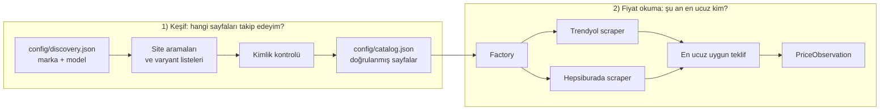

# Akıllı Telefon İndirim Takip Sistemi

Trendyol ve Hepsiburada'daki akıllı telefon tekliflerini bulan, doğrulayan ve
her telefon için takip edilen **en ucuz teklifi** çıkaran sistem. Uzun vadede
fiyat geçmişini saklayıp bir telefonun yakında indirime girip girmeyeceğini
tahmin etmesi planlanıyor.

Bu README, bugüne kadar **biten** kısmın ne işe yaradığını ve nasıl çalıştığını
anlatır. Kararların ve aşama durumunun ana kaynağı [proje_plani.md](proje_plani.md)
dosyasıdır.

## Durum özeti

| Parça | Durum |
|---|---|
| Fiyat okuma (scraper): Trendyol, Hepsiburada | ✅ Bitti; komutla çalışır |
| Otomatik model/kapasite/renk keşfi (discovery) | ✅ Bitti; komutla çalışır |
| Otomatik testler, canlı kontrol araçları, CI | ✅ Bitti |
| Scraper/discovery kabul kontrolü (6 adım) | ✅ Bitti (bkz. [Kabul kontrolü](#kabul-kontrolü-eylül-2026)) |
| Veritabanı, zamanlanmış toplama | ⏳ Sıradaki aşama; teknoloji henüz seçilmedi |
| FastAPI, Streamlit arayüzü, ML, Docker | 🔜 Planlandı; başlanmadı |

Yerel bilgisayardaki `app/database`, `app/ml_model`, `app/api`, `app/services`,
`app/worker.py`, `frontend/` ve Docker dosyaları eski taslaklardır; tamamlanmış
özellik değildir ve Git'e gönderilmez. Git'teki kod yalnızca biten aşamanın
tanımlarını ve bağımlılıklarını (pydantic, curl-cffi, beautifulsoup4, filelock)
içerdiği için bu taslaklar olduğu gibi çalışmaz; ilgili aşamada yeni tasarıma
göre yeniden ele alınacaklardır.

## Temel kavramlar

Projenin bütün kuralları bu üç kavram üzerine kuruludur:

| Kavram | Anlamı | Örnek |
|---|---|---|
| **Ürün** (`product`) | Marka + tam model + depolama kapasitesi. Fiyatlar bu birimde karşılaştırılır. | Apple iPhone 15 128 GB (`product_id=1`) |
| **Bağlantı** (`listing`) | Ürünün bir sitedeki **bir sayfası**; genelde her renk ayrı sayfadır. | Trendyol'daki "iPhone 15 128 GB Mavi" sayfası |
| **Teklif** (`offer`) | O sayfada ürünü satan bir satıcı ve fiyatı. | Aynı sayfada Trendyol 56.999 TL, ALDIMGİTTİ 59.599 TL |

Bir ürünün birçok bağlantısı, her bağlantının birçok teklifi vardır. iPhone 15
128 GB ile 256 GB **farklı ürünlerdir**; Pro, Plus, 16e, FE gibi modeller de
ayrıdır. RAM farkı ürünü bölmez. Katalog satıcı başına adres tutmaz; ürün
sayfası tutar, satıcıları scraper o sayfada karşılaştırır.

## Nasıl çalışır

Sistem bugün iki ayrı parçadan oluşur ve ikisi de komutla çalıştırılır:



- **Keşif** seyrek çalışır (yeni renk/kapasite seyrek çıkar). Kullanıcı yalnızca
  "Apple / iPhone 15" yazar; sayfaları sistem bulur. Yeni telefon için Python
  kodu değiştirilmez, renk bağlantısı elle toplanmaz.
- **Fiyat okuma** ileride günde birkaç kez çalışacak ve sonuçlar veritabanına
  yazılacak. Bugün sonuç ekrana basılır; veritabanı yoktur.
- Kullanıcı arama yaptığında canlı scraping yapılmayacaktır; arayüz önceden
  toplanmış sonuçları okuyacaktır.

### Örnek: iPhone 15 128 GB baştan sona

1. `discovery.json` içinde `Apple / iPhone 15` hedefi var.
2. Keşif Trendyol aramasında 122 iPhone kartı görür. 5'i gerçekten iPhone 15'tir,
   gerisi (iPhone 16, 15 Pro, 17…) başka model diye elenir. Hepsiburada'da tek
   bir ürün sayfasındaki seçenek listesinden 15 renk/kapasite sayfasına ulaşır.
3. Doğrulanan sayfalar kataloğa yazılır: iPhone 15 128 GB için Trendyol'da 3,
   Hepsiburada'da 6 sayfa.
4. Scraper bu 9 sayfanın her birindeki satıcıları karşılaştırır (ör. Hepsiburada
   Mavi sayfasında 11 satıcı).
5. Ürünün takip edilen en ucuz teklifi: 56.999 TL (tarayıcıda doğrulandı).

## Dosyalar ve sorumlulukları

### Ayarlar: `config/` (kod değil, veri)

| Dosya | Ne işe yarar | Kim yazar |
|---|---|---|
| `discovery.json` | Takip edilecek telefonlar ve tarama sınırları | Kullanıcı |
| `catalog.json` | Keşfin doğruladığı ürünler ve sayfalar | Keşif (elle yazılmaz) |
| `runtime.json` | Zaman aşımı, tekrar deneme, istekler arası bekleme (3 sn) | Kullanıcı, nadiren |

### Ortak parçalar: `app/`

| Dosya | Ne işe yarar |
|---|---|
| `contracts.py` | Verinin şekilleri ve doğrulaması (Pydantic V2 strict): `Product`, `Listing`, `Catalog`, `PriceObservation`, keşif hedefleri ve raporu. Hatalı veri içeri giremez (ör. fiyat alanına "Tükendi"). Yalnızca biten aşamanın kullandığı tanımları içerir. |
| `settings.py` | Ayar dosyalarını okur. `CATALOG_PATH`, `DISCOVERY_PATH`, `RUNTIME_PATH` ortam değişkenleriyle başka dosya gösterilebilir. |

### Fiyat okuma: `app/scraper/`

| Dosya | Ne işe yarar |
|---|---|
| `http.py` | İnternete açılan tek kapı. `curl_cffi` + `impersonate="chrome120"`; yalnızca izinli alan adları, zaman aşımı, sınırlı tekrar, istek aralığı, yönlendirme kontrolü, 8 MB yanıt sınırı, istek bütçesi. 401/403/418/429 yanıtları `blocked` olarak sınıflanır. Playwright, Selenium veya `requests` kullanılmaz. |
| `parsing.py` | Ortak yardımcılar: fiyatı kuruşa çevirme (`money`), metin normalleştirme, sayfaya gömülü JSON okuma ve **kimlik kuralları** (`identify`, `verify_identity`, `matches_model`). Keşif ve scraper aynı kuralları kullanır. |
| `base.py` | Bütün sitelerin sözleşmesi: `fetch(listing) -> PriceObservation`. Ayrıştırma hatalarını ortak `FetchError`'a çevirir. |
| `factory.py` | Platform adından (`trendyol`, `hepsiburada`) doğru scraper sınıfını yükler. |
| `trendyol_scraper.py` | Trendyol sayfasını okur, satıcıları karşılaştırır. |
| `hepsiburada_scraper.py` | Hepsiburada sayfası + satıcı listesi API'si + fiyat API'siyle satıcıları karşılaştırır. |

### Keşif: `app/discovery/`

| Dosya | Ne işe yarar |
|---|---|
| `trendyol.py` | Trendyol arama API'si, filtreler, varyant (renk/kapasite) listeleri ve ürün sayfası doğrulaması. |
| `hepsiburada.py` | Hepsiburada arama/model sayfası kartları, grup sayfaları ve ürün sayfasındaki seçenek listesi. |
| `matching.py` | "Yeni telefon kategorisi mi?" kuralı (aksesuar ve yenilenmiş kategoriler hariç). |
| `base.py` | Ortak iskelet: istek bütçesi, uyarı listesi (`issues`) ve tanılama izi (`trace`). |
| `service.py` | Platformları çalıştırır, sonuçları katalogla birleştirir, raporu yazar. |
| `__main__.py` | Komut satırı: `python -m app.discovery`. |

### Testler ve CI

| Yer | Ne işe yarar |
|---|---|
| `tests/test_trendyol_scraper.py`, `tests/test_hepsiburada_scraper.py`, `tests/test_discovery.py` | Kayıtlı örnek verilerle otomatik testler (47 test). İnternete çıkmaz. |
| `tests/fixtures/discovery/` | Testlerin kullandığı örnek site yanıtları. |
| `tests/manual/live_scraper_check.py` | Katalogdaki sayfaları canlı okur; bütün satıcıları gösterir. |
| `tests/manual/live_discovery_check.py` | Keşfi kataloğa yazmadan canlı çalıştırır; `--trace` ile her kararın nedenini gösterir. |
| `.github/workflows/ci.yml` | Her push/pull request'te Black, Flake8 ve testleri çalıştırır. |

## Kurulum ve komutlar

Windows ve PowerShell, Python sanal ortamı `.venv`:

```powershell
# Kurulum: yalnız biten aşamanın bağımlılıkları + test/biçim araçları
.venv\Scripts\python.exe -m pip install -e ".[dev]"

# Otomatik testler (internete çıkmaz)
.venv\Scripts\python.exe -m pytest tests/test_trendyol_scraper.py tests/test_hepsiburada_scraper.py tests/test_discovery.py -q

# Biçim ve kalite kontrolü (yalnız değişen dosyalarda çalıştırın)
.venv\Scripts\python.exe -m black --check <dosyalar>
.venv\Scripts\python.exe -m flake8 <dosyalar>

# Keşif: önce kataloğu değiştirmeden rapor
.venv\Scripts\python.exe -m app.discovery --dry-run --target apple_iphone_15

# Keşif: doğrulanan yeni sayfaları kataloğa ekle
.venv\Scripts\python.exe -m app.discovery --target apple_iphone_15

# Keşif tanılaması: rapor + her kararın izi (katalog değişmez)
.venv\Scripts\python.exe tests\manual\live_discovery_check.py apple_iphone_15 --trace

# Canlı fiyat kontrolü: katalogdaki bütün sayfalar
.venv\Scripts\python.exe tests\manual\live_scraper_check.py
```

`--target` verilmezse bütün etkin hedefler taranır. Yerelde sonraki aşamalara
ait taslak dosyalar bulunduğu için Black/Flake8'i bütün `app` klasöründe değil,
değişen dosyalarda çalıştırın; CI yalnızca Git'teki dosyaları denetler.

Gerçek dosyalara dokunmadan denemek için ortam değişkeni kullanılabilir:

```powershell
$env:CATALOG_PATH = "data/deneme_katalog.json"   # kataloğun kopyası
$env:DISCOVERY_PATH = "data/deneme_hedef.json"   # geçici hedefler
```

## Yeni telefon ekleme

`config/discovery.json` içine marka ve **tam** model yazılır; adres girilmez:

```json
{
  "targets": [
    {"key": "apple_iphone_15", "brand": "Apple", "model": "iPhone 15"},
    {"key": "samsung_galaxy_s24", "brand": "Samsung", "model": "Galaxy S24"},
    {
      "key": "xiaomi_redmi_note_14",
      "brand": "Xiaomi",
      "model": "Redmi Note 14",
      "exclude_terms": ["5G"]
    },
    {"key": "xiaomi_redmi_note_14_5g", "brand": "Xiaomi", "model": "Redmi Note 14 5G"}
  ],
  "max_search_pages": 20,
  "max_product_pages": 100,
  "max_requests": 200
}
```

- `model: "iPhone 16"` → iPhone 16 Pro, Plus, 16e **kapsanmaz**; bunlar ayrı hedeftir.
- **`exclude_terms`** (isteğe bağlı): Aynı adı taşıyan farklı telefonları ayırır.
  Redmi Note 14 (4G) ile Note 14 5G farklı işlemcili, farklı fiyatlı
  telefonlardır; `["5G"]` yazılmazsa aynı ürüne karışır ve 4G stoktan çıkıp
  döndüğünde sahte fiyat artışı/indirimi oluşur. Terim bütün sözcük olarak
  aranır ("5G" bulunur, "5 GB RAM" bulunmaz). Varsayılanı boştur; genel bir
  "5G ayrı model" kuralı bilinçli olarak yoktur, çünkü adında her zaman 5G geçen
  modellerde (ör. Galaxy A55 5G) doğru sayfaları kaybettirir.
- Bugün gerçek dosyada yalnızca `apple_iphone_15` ve `apple_iphone_16` etkindir.
  Galaxy S24 ve Redmi Note 14 geçici dosyalarla denenmiş, kataloğa eklenmemiştir.

## Keşif nasıl çalışır

### Trendyol

1. Ana sayfa ve arama sayfası açılarak oturum hazırlanır.
2. Arama API'sine "marka + model" sorulur.
3. Yanıttaki filtre listesinden marka ve **telefon kategorisi** filtresi bulunur;
   kılıf ve aksesuarlar böylece elenir. Marka önce `canonicalFilters`, yoksa
   `aggregation/WebBrand` içinden okunur. "Yenilenmiş Cep Telefonu" telefon
   kategorisi sayılmaz. Birden çok geçerli telefon kategorisi varsa yalnızca ilki
   taranır ve rapora `category_partial` yazılır.
4. Sayfalar kaynaktaki "sonraki" bağlantısıyla gezilir (en fazla 20 sayfa).
   Toplam ürün sayısı tutmazsa `count_mismatch` raporlanır.
5. Her arama kartı için karar verilir: kabul, `excluded_word` (kılıf, yenilenmiş…),
   `other_model` (Pro, 16e, başka model), `excluded_term`, `brand`, `category`.
6. Kabul edilen kartların ürün grubu için Trendyol'un "renk/kapasite seçenekleri"
   listesi (`slicing-attributes`) okunur; kardeş sayfalar eklenir.
7. Her aday sayfa açılır: ürün kimliği, marka, telefon kategorisi, model ve
   kapasite doğrulanır.

### Hepsiburada

1. Arama sayfası (`ara?q=…`) okunur. Varsa model filtresi sayfasına
   (`…-xc-…`) geçilir; bulunamazsa `model_filter_missing` raporlanır.
2. Ürün kartları toplanır. Kart iki biçimde olabilir:
   `-p-HBCV…` (ürün sayfası) veya `-pm-HBC…` (grup sayfası). Grup sayfası
   **aday olmaz**; yalnızca gerçek ürün SKU'larına çözülür.
3. Arama API'si denenir; bugün engellenir (`search_api: blocked`). Engel olsa da
   HTML'den bulunanlar korunur.
4. Her ürün sayfası açılır, kimlik doğrulanır ve sayfadaki
   `allVariantCombinations` (bütün renk/kapasite seçenekleri) kuyruğa eklenir.
   Stoksuz olduğu için aramada görünmeyen kapasiteler de böyle bulunur.

### Katalogla birleştirme (`service.py`)

- Ürün kimliği: marka + model + kapasite. Bağlantı kimliği: platform + sitedeki
  ürün kimliği/SKU. Yeni bağlantı adı `platform_urunkimligi` biçimindedir.
- Mevcut kimlikler değişmez; kimlik başka ürün için tekrar kullanılmaz; bu
  taramada görülmeyen eski kayıtlar **silinmez**.
- Aynı keşfi tekrar çalıştırmak çift kayıt üretmez (canlıda doğrulandı: ikinci
  çalışmada sıfır ekleme, dosya bayt düzeyinde aynı).
- Katalogdaki bir sayfa bu kez başka ürün (ör. başka kapasite) olarak görülürse
  o aday yazılmaz, mevcut kayıt korunur ve rapora `catalog_conflict` yazılır;
  diğer geçerli adaylar yine eklenir.
- Dosya kilit altında yeniden okunur ve atomik olarak (geçici dosya + yer
  değiştirme) yazılır. `--dry-run` kataloğa hiç yazmaz.

### Rapor: `data/discovery_report.json`

| Alan | Anlamı |
|---|---|
| `complete` | Kullanılan kaynakların tamamı tarandı mı. Bütün pazaryerinin bulunduğunu **kanıtlamaz**. |
| `added_products`, `added_listings` | Bu çalışmada eklenen ürünler/sayfalar. |
| `existing_listings` | Yeniden görülen, zaten katalogda olan sayfalar. |
| `retained_unobserved_listings` | Bu taramada görülmeyen ama katalogda korunan sayfalar; güncel teklif sayılmaz. |
| `pending` | Taramayı kısmi yapan nedenler (aşağıdaki tablo). |
| `rejected` | Reddedilen sayfalar ve nedenleri (gözlenen ürün adıyla) ve `catalog_conflict` kayıtları. |
| `observed_colors` | Kapasite ve platform bazında bulunan renkler; pazaryerinin eksiksiz renk listesi değildir. |

| Uyarı | Anlamı |
|---|---|
| `search_api` | Hepsiburada arama API'si engellendi. |
| `model_filter_missing` | Hepsiburada model filtresi sayfası bulunamadı; genel arama sayfası kullanıldı. |
| `html_partial` | Sayfadaki kart sayısı sitenin bildirdiği toplamdan az. |
| `filter_unavailable` | Trendyol telefon kategorisi filtresi bulunamadı. |
| `category_partial` | Birden çok telefon kategorisi var, yalnızca ilki tarandı. |
| `count_mismatch` | Trendyol'un bildirdiği toplamla gelen ürün sayısı farklı. |
| `search_limit`, `product_limit` | Sayfa veya ürün sınırı doldu. |
| `variant_fetch`, `missing_variants` | Varyant listesi alınamadı veya boş geldi. |
| `candidate_rejected` | Aday sayfa doğrulanamadı; ayrıntıda neden ve ürün adı var. |

Komutun çıkış kodu: `0` tam tarama, `2` kısmi tarama (doğrulanmış kayıtlar yine
eklenir), `1` keşif başlatılamadı.

## Fiyat okuma nasıl çalışır

### Trendyol (sayfa başına 1 istek)

1. Ürün sayfası indirilir; `window['__envoy__SHARED_PROPS']` içindeki ürün verisi okunur.
2. Kimlik doğrulanır: URL'deki ürün kimliği, model ve kapasite (başlık +
   `Dahili Hafıza`/`slicingAttributes`).
3. Ana satıcı (buybox) ve `otherMerchants` teklifleri okunur.
4. Elenenler: stok dışı, yenilenmiş/ikinci el/teşhir, fiyatı veya satıcısı eksik,
   başka ürün sayfasına (başka renk) ait teklifler.
5. Kalanlardan en ucuzu seçilir; eşitlikte satıcı adına göre karar verilir.

### Hepsiburada (sayfa başına 3 istek)

1. Ürün sayfası indirilir; kimlik doğrulanır (JSON-LD adları, sayfa başlığı ve
   seçenek listesindeki `Kapasite`).
2. `/api/v1/product/listings/{sku}` ile bütün satıcılar alınır.
3. Satılabilir satıcı yoksa sonuç `Tükendi` olur.
4. Aynı oturumla `otherMerchants` fiyat isteği gönderilir; yenilenmiş/teşhir
   teklifleri elenir, en ucuz geçerli teklif seçilir.

### Fiyat ve stok kuralları

- **Güncel fiyat:** Sayfada gösterilen, koşulsuz indirimli fiyat.
  Trendyol'da `discountedPrice` ile `sellingPrice`'ın küçüğü (ör. "Net 400 TL
  İndirim" → 59.599 TL); Hepsiburada'da `discountedPrice`, yoksa `price`.
  "2 adet ve üzeri", sepet veya kupon koşullu indirimler dahil edilmez.
- **Üstü çizili fiyat:** Sayfada çizili görünen fiyat (Trendyol'da `originalPrice`
  ile `sellingPrice`'ın büyüğü); güncel fiyattan büyük değilse `null`. Üstü çizili
  fiyat ileride indirim tahmininin referansı **değildir**.
- Para kuruş cinsinden tam sayıdır: `5724900` = 57.249,00 TL.
- **Tükendi** yalnızca açık stok sinyaliyle verilir: Trendyol'da sayfadaki uygun
  teklifler açıkça stok dışıysa, Hepsiburada'da satıcı listesinde satılabilir
  teklif yoksa. Ağ/ayrıştırma hatası, engellenme veya çelişkili yanıt (satıcı
  listesi "satılabilir" deyip fiyat API'sinin boş dönmesi) **Tükendi değildir**,
  hata olarak raporlanır.
- **Kritik Stok** yalnızca Trendyol'un açık sinyaliyle (`isRunningOut`) verilir;
  Hepsiburada bu sinyali sağlamadığı için orada hiç üretilmez.

### Dönen alanlar: `PriceObservation`

| Alan | Anlamı |
|---|---|
| `listing_id` | Katalogdaki kalıcı bağlantı kimliği |
| `product_id` | Model ve kapasite düzeyindeki ürün kimliği |
| `platform` | Teklifin geldiği platform |
| `product_name`, `product_url` | Katalogdaki ürün adı ve kontrol edilen sayfa |
| `current_price` | Güncel fiyat (kuruş) |
| `original_price` | Üstü çizili fiyat (kuruş) veya `null` |
| `seller_name`, `seller_rating`, `seller_rating_scale` | Seçilen teklifin satıcısı ve puanı (puan yoksa `null`) |
| `stock_status` | `Stokta Var`, `Kritik Stok` veya `Tükendi` |
| `timestamp`, `currency` | UTC gözlem zamanı, `TRY` |

`null` hata anlamına gelmez; kaynakta o bilginin güvenilir olarak bulunmadığını
gösterir. Satıcıların bütün teklifleri tek tek kaydedilmez; yalnızca seçilen
teklif döner. Bütün teklifler canlı kontrol aracında (`all_offers`) görülebilir.

## Kimlik kuralları

Keşif ve scraper aynı fonksiyonu (`app/scraper/parsing.py → identify`) kullanır;
böylece keşfin kabul ettiği sayfayı scraper aynı girdilerle reddetmez.

- Başlık tam modeli içermeli: "iPhone 16" hedefi "iPhone 16e", "16 Plus",
  "16 Pro" başlıklarını; "Galaxy S24" hedefi "S24+", "S24 FE", "S24 Ultra"
  başlıklarını; "iPhone 13" hedefi "13 mini" başlığını kabul etmez.
- Yenilenmiş, ikinci el, teşhir ve aksesuar (kılıf, şarj, koruyucu…) reddedilir.
- Kapasite, sayfanın yapısal verisinden ve başlıktan okunur; iki kaynak
  çelişirse sayfa reddedilir, hiçbirinde yoksa da reddedilir. TB desteklenir
  (1 TB = 1024 GB). Başlıkta hem RAM hem depolama yazıyorsa (ör. "8 GB RAM
  256 GB") yapısal veri kullanılır.
- Hedefin `exclude_terms` ifadelerini içeren başlıklar reddedilir.

## Testler ne kanıtlar, ne kanıtlamaz

- **Otomatik testler (47):** Kuralların doğru çalıştığını kayıtlı yanıtlarla
  kanıtlar. Hata düzeltmelerinin her biri, canlıda görülen gerçek bir örneğe
  dayanan regresyon testiyle korunur. Sitelerin bugün hâlâ aynı yapıda olduğunu
  kanıtlamaz.
- **Canlı kontrol araçları:** Bugünkü site uyumunu aynı üretim koduyla sınar.
  Pazaryerindeki her sayfanın katalogda olduğunu kanıtlamaz.
- "Testler geçti" ile "bütün pazaryeri eksiksiz tarandı" aynı şey değildir.

## Kabul kontrolü (Eylül 2026)

Veritabanına geçmeden önce scraper ve discovery 6 adımda, canlı veri ve tarayıcı
karşılaştırmasıyla denetlendi. Sonuç: katalogdaki 44 sayfanın tamamı hatasız
sınıflandı (16 Stokta Var, 5 Kritik Stok, 23 Tükendi); satıcı listeleri, fiyatlar
ve üstü çizili fiyatlar tarayıcıda görülenle eşleşti. Bulunup düzeltilenler:

| Sorun | Çözüm |
|---|---|
| Keşfin sessiz eleme kararları görünmüyordu | `--trace` tanılama izi |
| Keşif ve scraper modeli farklı kurallarla kontrol ediyordu; başlığında "GB" yazmayan Hepsiburada sayfaları hiç okunamıyordu | Tek ortak kimlik kuralı (`identify`) |
| Hepsiburada `-pm-` grup kartları görülmüyordu (bir iPhone 15 ailesi eksikti) | Grup sayfaları gerçek SKU'ya çözülüyor; eksik sayfa kataloğa eklendi |
| Stoksuz Hepsiburada sayfaları "Tükendi" yerine hata veriyordu | Satıcı listesi boşsa doğrudan `Tükendi` |
| Çelişkili Hepsiburada yanıtı "Tükendi" sayılıyordu | `api_error` |
| "Yenilenmiş Cep Telefonu" telefon kategorisi sayılabiliyordu | Hariç tutuluyor |
| Boş SKU'lu bir varyant kaydı bütün keşfi raporsuz durduruyordu | Kayıt atlanıyor, hata raporlanıyor |
| Xiaomi'de marka filtresi bulunamıyor, arama 71.450 ürünle (çoğu kılıf) doluyordu | Marka filtre listesinden de okunuyor (129 ürün, tam tarama) |
| Redmi Note 14 ile Note 14 5G aynı ürün sanılıyordu | `exclude_terms` |
| Trendyol'da satıcının koşulsuz indirimi atlanıyordu | Sayfadaki indirimli fiyat kaydediliyor |
| Tek bir tutarsız aday bütün keşif çalışmasını raporsuz durduruyordu | Yalnızca o aday atlanıyor (`catalog_conflict`) |
| Arama aşamasındaki bozuk yanıt bütün keşfi çökertebiliyordu | Ortak kurtarılabilir hata listesi; uyarı olarak raporlanıyor |
| Hepsiburada'nın bildirdiği sayfa adresi alan adı kontrolsüz kullanılıyordu | Yalnızca `https://www.hepsiburada.com/` kabul ediliyor |
| Keşif, hiç kullanmadığı API paketine (`slowapi`/`limits`) bağımlıydı; ölü kod ve gelecek aşama tanımları vardı | Temizlendi; bağımlılıklar yalnızca biten aşamanınkiler |

Trendyol model filtresinin (ör. "Cep Telefonu Modeli: iPhone 16") kullanılması
değerlendirildi ve **reddedildi**: satıcıların girdiği bu özellik güvenilir
değil (iPhone 16e sayfaları "iPhone 16" olarak etiketli) ve hiçbir marka 20
sayfa sınırına yaklaşmadı (Apple 3–4, Samsung 6, Xiaomi 4 sayfa).

## Bilinen sınırlar

- **Hepsiburada arama API'si** bizi engelliyor; Hepsiburada taraması her zaman
  "kısmi" raporlanır. Kapsamı arama/model sayfasının ilk sayfası ve ürün
  sayfalarındaki seçenek listesi taşır; ayrı bir ürün ailesi yalnızca kartı
  görünürse bulunur.
- **iPhone dışındaki markalarda** Hepsiburada model filtresi sayfası bulunamadı;
  genel arama sayfası kullanılır. Denemelerde bütün kartlar ilk sayfaya sığdı
  (S24 18/18, Redmi Note 14 17/17); daha kalabalık aramalarda bu garanti değildir.
- **Trendyol araması ve varyant listesi** yalnızca satıştaki sayfaları gösterir.
  Stoktan çıkan bir sayfa yeniden keşfedilemez; önceden kataloğa girmişse korunur.
  Bugün Trendyol'da iPhone 16 256/512 GB ve iPhone 15 512 GB satışta değildir.
- Katalogdaki üç Trendyol bağlantısı (`trendyol_762254849`, `trendyol_762254854`,
  `trendyol_865248542`) geçmişte elle verilmişti; otomatik keşifte yeniden
  bulunamıyorlar ve şu an stoksuzlar. Otomatik keşfedilmiş sayılmazlar.
- **Garanti türü** ayrılmıyor. Ör. `trendyol_991304922` bir "International
  Version" (yurt dışı sürümü) ve Türkiye garantili tekliflerle aynı
  karşılaştırmaya giriyor. Garantiye göre ayrım sonraki bir karardır.
- **Renk adları** sitelerin kendi etiketleridir; platformlar arasında
  birleştirilmez ("Lacivert" / "Laciverttaş").
- `exclude_terms` keşif anında uygulanır; hedefe sonradan terim eklenirse daha
  önce kataloğa girmiş sayfalar kendiliğinden çıkarılmaz.
- Siteler sayfa yapısını değiştirebilir; bu durumda bakım gerekebilir. Kod,
  değişiklikte sessizce yanlış sonuç üretmek yerine hatayı raporlamaya çalışır.

## Sıradaki aşamalar

1. **Veritabanı değerlendirmesi:** Veri modeli, çalışma ortamı ve teknoloji
   (SQLite önceki öneri, kesin değil) kullanıcıyla birlikte seçilecek.
2. Keşif ve fiyat okumayı zamanlanmış toplama akışına bağlamak; tekrar kayıtları
   engellemek; katalog/kapsam değişikliğinin sahte fiyat düşüşü üretmemesi.
3. Hazır fiyat/geçmiş özetlerini FastAPI'den sunmak ve Streamlit'te göstermek.
4. Yeterli geçmiş biriktiğinde ML (tek ortak LightGBM modeli); veri yetersizse
   tahmin yüzdesi gösterilmez.
