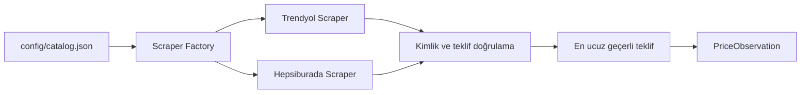

# Akıllı Telefon İndirim Takip Sistemi

Bu proje Trendyol ve Hepsiburada üzerindeki akıllı telefon tekliflerini toplar,
doğrular ve karşılaştırılabilir tek bir veri biçimine dönüştürür. İlk tamamlanan
kilometre taşı scraper ve katalog katmanıdır.

## Tamamlanan kapsam

- HTTP istekleri yalnızca `curl_cffi` ve `impersonate="chrome120"` ile yapılır.
- Trendyol ve Hepsiburada aynı `BaseScraper` sözleşmesini uygular.
- Ürün adı, model, kapasite ve platform ürün kimliği doğrulanır.
- Satışa kapalı, yenilenmiş, ikinci el ve teşhir teklifleri elenir.
- Geçerli teklifler arasından en düşük fiyatlı teklif seçilir.
- Fiyat, satıcı, satıcı puanı ve stok aynı tekliften alınır.
- Para değerleri kuruş cinsinden tam sayı olarak üretilir.
- Ürün ve izleme bağlantıları `config/catalog.json` üzerinden yönetilir.

Bu kilometre taşında otomatik ürün/renk keşfi, veritabanı, API, arayüz ve ML
katmanları Git kapsamına alınmamıştır. Bunlar sonraki bağımsız kilometre
taşlarıdır.

## Üretim akışı



`factory.py`, katalogdaki platform anahtarına göre doğru scraper sınıfını yükler.
Her scraper içeride platformun bütün erişilebilir tekliflerini inceler. Uygulama
katmanına yalnızca seçilen teklif bir `PriceObservation` olarak döner.

### Trendyol

1. Ürün sayfası indirilir.
2. `window['__envoy__SHARED_PROPS']` içindeki ürün verisi ayrıştırılır.
3. Model, kapasite ve URL'deki ürün kimliği doğrulanır.
4. Buybox ve `otherMerchants` teklifleri okunur.
5. Mevcut katalog bağlantısıyla aynı ürün sayfasına ait satıcılar karşılaştırılır.
6. Başka renk veya ürün sayfasına yönlenen teklifler tanılamada gösterilir ancak
   mevcut listing hesabına katılmaz. Otomatik keşif katmanı bunları daha sonra
   ayrı listing olarak kaydedecektir.

### Hepsiburada

1. Ürün sayfası indirilir ve SKU doğrulanır.
2. `/api/v1/product/listings/{sku}` üzerinden bütün satıcılar alınır.
3. Satılabilir ve uygun durumdaki teklifler belirlenir.
4. Aynı HTTP session ile `otherMerchants` fiyatlandırma isteği gönderilir.
5. Güncel fiyatlar karşılaştırılır ve en ucuz geçerli satıcı seçilir.

## Dönen alanlar

| Alan | Anlamı |
|---|---|
| `listing_id` | Katalogdaki kalıcı bağlantı kimliği. |
| `product_id` | Model ve kapasite düzeyindeki ürün kimliği. |
| `platform` | Teklifin geldiği platform. |
| `product_name` | Doğrulanmış katalog ürün adı. |
| `product_url` | Kontrol edilen katalog bağlantısı. |
| `current_price` | Güncel fiyat; kuruş cinsinden tam sayı. |
| `original_price` | Güncel fiyattan büyük, doğrulanmış üstü çizili fiyat. |
| `seller_name` | Seçilen teklifin satıcısı. |
| `seller_rating` | Kaynakta bulunan satıcı puanı. |
| `seller_rating_scale` | Satıcı puanının üst sınırı. |
| `stock_status` | `Stokta Var`, `Kritik Stok` veya `Tükendi`. |
| `timestamp` | UTC gözlem zamanı. |
| `currency` | Para birimi; `TRY`. |

`null` hata anlamına gelmez. Örneğin `original_price=null`, güncel fiyattan
büyük doğrulanmış bir üstü çizili fiyat bulunmadığını gösterir.
`seller_rating=null` ise kaynakta güvenilir bir satıcı puanı veya yeterli
değerlendirme bulunmadığını gösterir. `5724900` kuruş, `57.249,00 TL` demektir.

## Testler

Otomatik testler canlı sitelere bağlanmaz. Kaydedilmiş örnek veri yapılarıyla
fiyat seçimini, ürün kimliğini, durum filtrelerini ve HTTP hata davranışını
kontrol eder.

```powershell
.venv\Scripts\python.exe -m pytest -q
```

Biçim ve statik kontroller:

```powershell
.venv\Scripts\python.exe -m black --check app tests
.venv\Scripts\python.exe -m flake8 --jobs 1 app tests
```

GitHub Actions aynı kontrolleri her push ve pull request işleminde çalıştırır.

## Canlı scraper kontrolü

Canlı kontrol aracı gerçek katalog bağlantılarına istek gönderir ve veritabanına
yazmaz:

```powershell
.venv\Scripts\python.exe tests\manual\live_scraper_check.py
```

Her platform için iki ayrı görünüm üretir:

- `production_result`: Üretim kodunun dışarıya döndürdüğü tek seçilmiş teklif.
- `all_offers`: Scraper'ın aynı çalışmada incelediği bütün satıcı teklifleri.

`all_offers` içindeki alanlar:

- `eligible`: Teklifin fiyat karşılaştırmasına katılıp katılmadığı.
- `rejection_reason`: Elenme nedeni (`out_of_stock`, `disallowed_condition`,
  `different_product_page`, `missing_price` gibi).
- `selected`: Üretim sonucunda seçilen teklif.
- `offer_url`: Teklifin platformdaki bağlantısı.
- `current_price_display` ve `original_price_display`: Kuruş değerlerinin
  `57.249,00 TL` biçimindeki okunabilir karşılığı.

Bu araç üretimden farklı bir scraper kullanmaz. Factory üzerinden aynı platform
sınıflarını çalıştırır; yalnızca test amacıyla scraper'ın o çalışma sırasında
incelediği teklif listesini de ekrana basar.

## Katalog

`config/catalog.json` içinde:

- Platformlar alan adı ve etkinlik bilgisiyle tanımlanır.
- Her model ve kapasite ayrı `product_id` alır.
- Renk ve platform bağlantıları aynı ürüne bağlı ayrı listing kayıtlarıdır.
- Bir kimlik geçmişte kullanıldıysa başka ürün veya URL için tekrar kullanılmaz.

Yeni telefon ve renk bağlantılarının otomatik bulunması bir sonraki geliştirme
aşamasıdır. Bu aşama tamamlandığında katalogda URL'leri elle yönetmek
gerekmeyecektir.
