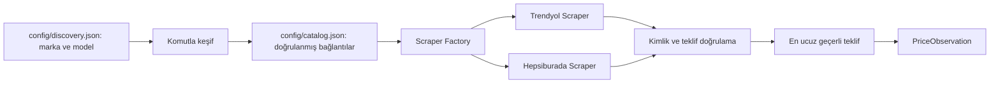

# Akıllı Telefon İndirim Takip Sistemi

Bu proje Trendyol ve Hepsiburada üzerindeki akıllı telefon tekliflerini toplar,
doğrular ve karşılaştırılabilir tek bir veri biçimine dönüştürür. Şu anda
scraper ve komutla çalışan model/renk keşfi kullanılabilir. Keşif, kaynakların
göstermediği bütün ürün sayfalarını bulduğunu garanti etmez.

## Tamamlanan kapsam

- HTTP istekleri yalnızca `curl_cffi` ve `impersonate="chrome120"` ile yapılır.
- Trendyol ve Hepsiburada aynı `BaseScraper` sözleşmesini uygular.
- Ürün adı, model, kapasite ve platform ürün kimliği doğrulanır.
- Satışa kapalı, yenilenmiş, ikinci el ve teşhir teklifleri elenir.
- Geçerli teklifler arasından en düşük fiyatlı teklif seçilir.
- Fiyat, satıcı, satıcı puanı ve stok aynı tekliften alınır.
- Para değerleri kuruş cinsinden tam sayı olarak üretilir.
- Ürün ve izleme bağlantıları `config/catalog.json` üzerinden yönetilir.

Veritabanı, API, arayüz ve ML sonraki bağımsız kilometre taşlarıdır.

## Şu an çalışan akış



`factory.py`, katalogdaki platform anahtarına göre doğru scraper sınıfını yükler.
Her scraper içeride platformun bütün erişilebilir tekliflerini inceler. Uygulama
katmanına yalnızca seçilen teklif bir `PriceObservation` olarak döner.
Keşif ve canlı scraper kontrolü şimdilik ayrı komutlarla çalışır. Zamanlanmış
toplama ve veritabanına yazma henüz bu akışa bağlanmamıştır.

### Trendyol

1. Ürün sayfası indirilir.
2. `window['__envoy__SHARED_PROPS']` içindeki ürün verisi ayrıştırılır.
3. Model, kapasite ve URL'deki ürün kimliği doğrulanır.
4. Buybox ve `otherMerchants` teklifleri okunur.
5. Mevcut katalog bağlantısıyla aynı ürün sayfasına ait satıcılar karşılaştırılır.
6. Başka renk veya ürün sayfasına yönlenen teklifler tanılamada gösterilir ancak
   mevcut listing hesabına katılmaz. Keşif kaynağında görülebilirlerse ayrı
   bağlantı olarak kataloğa eklenebilirler.

### Hepsiburada

1. Ürün sayfası indirilir ve SKU doğrulanır.
2. `/api/v1/product/listings/{sku}` üzerinden bütün satıcılar alınır.
3. Satılabilir ve uygun durumdaki teklifler belirlenir.
4. Aynı HTTP session ile `otherMerchants` fiyatlandırma isteği gönderilir.
5. Güncel fiyatlar karşılaştırılır ve en ucuz geçerli satıcı seçilir.

## Dönen alanlar

| Alan | Anlamı |
|---|---|
| `listing_id` | Katalogdaki kalıcı bağlantı kimliği. |
| `product_id` | Model ve kapasite düzeyindeki ürün kimliği. |
| `platform` | Teklifin geldiği platform. |
| `product_name` | Doğrulanmış katalog ürün adı. |
| `product_url` | Kontrol edilen katalog bağlantısı. |
| `current_price` | Güncel fiyat; kuruş cinsinden tam sayı. |
| `original_price` | Güncel fiyattan büyük, doğrulanmış üstü çizili fiyat. |
| `seller_name` | Seçilen teklifin satıcısı. |
| `seller_rating` | Kaynakta bulunan satıcı puanı. |
| `seller_rating_scale` | Satıcı puanının üst sınırı. |
| `stock_status` | `Stokta Var`, `Kritik Stok` veya `Tükendi`. |
| `timestamp` | UTC gözlem zamanı. |
| `currency` | Para birimi; `TRY`. |

`null` hata anlamına gelmez. Örneğin `original_price=null`, güncel fiyattan
büyük doğrulanmış bir üstü çizili fiyat bulunmadığını gösterir.
`seller_rating=null` ise kaynakta güvenilir bir satıcı puanı veya yeterli
değerlendirme bulunmadığını gösterir. `5724900` kuruş, `57.249,00 TL` demektir.

## Testler

Otomatik testler canlı sitelere bağlanmaz. Kaydedilmiş örnek veri yapılarıyla
fiyat seçimini, ürün kimliğini, durum filtrelerini ve HTTP hata davranışını
kontrol eder.

```powershell
.venv\Scripts\python.exe -m pytest -q
```

Biçim ve statik kontroller:

CI, Git'e gönderilmiş dosyaları Black ve Flake8 ile denetler. Yerel çalışma
dizinindeki sonraki aşama taslakları bu kilometre taşının parçası değildir.

GitHub Actions aynı kontrolleri her push ve pull request işleminde çalıştırır.

## Canlı scraper kontrolü

Canlı kontrol aracı gerçek katalog bağlantılarına istek gönderir ve veritabanına
yazmaz:

```powershell
.venv\Scripts\python.exe tests\manual\live_scraper_check.py
```

Her platform için iki ayrı görünüm üretir:

- `production_result`: Üretim kodunun dışarıya döndürdüğü tek seçilmiş teklif.
- `all_offers`: Scraper'ın aynı çalışmada incelediği bütün satıcı teklifleri.

`all_offers` içindeki alanlar:

- `eligible`: Teklifin fiyat karşılaştırmasına katılıp katılmadığı.
- `rejection_reason`: Elenme nedeni (`out_of_stock`, `disallowed_condition`,
  `different_product_page`, `missing_price` gibi).
- `selected`: Üretim sonucunda seçilen teklif.
- `offer_url`: Teklifin platformdaki bağlantısı.
- `current_price_display` ve `original_price_display`: Kuruş değerlerinin
  `57.249,00 TL` biçimindeki okunabilir karşılığı.

Bu araç üretimden farklı bir scraper kullanmaz. Factory üzerinden aynı platform
sınıflarını çalıştırır; yalnızca test amacıyla scraper'ın o çalışma sırasında
incelediği teklif listesini de ekrana basar.
Çoklu ürün kataloğunda `best_offers_by_product` her `product_id` için ayrı
hesaplanır; tek bağlantının hatası `errors` altında görünür ve diğer
bağlantıların kontrolünü durdurmaz.

## Katalog

`config/catalog.json` içinde:

- Platformlar alan adı ve etkinlik bilgisiyle tanımlanır.
- Her model ve kapasite ayrı `product_id` alır.
- Renk ve platform bağlantıları aynı ürüne bağlı ayrı listing kayıtlarıdır.
- Bir kimlik geçmişte kullanıldıysa başka ürün veya URL için tekrar kullanılmaz.

Katalog satıcıya özel URL tutmaz; ürün sayfası URL'si tutar. Scraper o sayfadaki
erişilebilir satıcı tekliflerini karşılaştırıp en ucuz uygun teklifi döndürür.
Aynı kapasitenin farklı renk ve ürün sayfaları ayrı ayrı izlenir; canlı kontrol
aracı bunların sonuçlarından ürün başına en ucuzunu gösterir. Satıcıların tüm
teklifleri fiyat geçmişine ayrı kayıt olarak yazılmaz.

Yeni telefon ve renk bağlantıları aşağıdaki keşif komutuyla bulunur.

## Otomatik model, kapasite ve renk keşfi

`config/discovery.json` içindeki hedeflerde yalnızca marka ve tam model yazılır;
ürün/renk URL'si girilmez.
Örneğin `Apple` / `iPhone 16` hedefi `iPhone 16 Pro` veya `iPhone 16e`
ürünlerini kapsamaz. Her depolama kapasitesi ayrı ürün, her renk ve platform
bağlantısı aynı kapasiteye bağlı ayrı listing olur. Doğrulanmış stoksuz
bağlantılar da izlenmek üzere korunur.

Önce kataloğu değiştirmeden raporu gör:

```powershell
.venv\Scripts\python.exe -m app.discovery --dry-run --target apple_iphone_15
```

Doğrulanmış bağlantıları kataloğa eklemek için `--dry-run` olmadan çalıştır:

```powershell
.venv\Scripts\python.exe -m app.discovery --target apple_iphone_15
```

`--target` kaldırılırsa bütün etkin hedefler taranır. Ayrıntılı rapor
`data/discovery_report.json` konumuna yazılır; `complete=false` erişim engeli,
sayfa sınırı veya doğrulama sorunu nedeniyle taramanın kısmi olduğunu belirtir.
Komut bu durumda çıkış kodu 2 döndürür; kısmi taramada doğrulanmış kayıtlar
yine eklenir, var olan kayıtlar silinmez. `--dry-run` katalog dosyasını
değiştirmez. Tanılama için aynı yol `tests/manual/live_discovery_check.py`
üzerinden de çalıştırılabilir.

Keşif, platform araması ve erişilebilir varyant verilerinde görünen sayfaları
doğrular. Arama ve varyant kaynaklarının hiç göstermediği sayfaları bulduğunu
iddia etmez; önceki keşiflerde kataloğa eklenmiş bağlantılar yeniden taramada
görünmeseler de korunur. Aynı renk ve kapasitedeki farklı ürün sayfaları ayrı
bağlantı olarak izlenebilir; satıcı başına URL tanımlanmaz. `observed_colors`
raporu doğrulanan renkleri kapasite ve platform bazında gösterir; bu liste bütün
pazaryeri renklerinin eksiksiz envanteri değildir. `complete` yalnızca kullanılan
kaynakların taranmasının tamamlandığını ifade eder.
`retained_unobserved_listings`, bu taramada görülmeyip katalogda korunan
bağlantıları gösterir; bunlar doğrulanmış güncel teklif sayılmaz.

Trendyol arama sayfaları ve varyant grupları, Hepsiburada ise filtrelenmiş
arama sayfası, erişilebilen arama API'si ve ürün sayfası varyantlarıyla
incelenir. Engellenen Hepsiburada API'si tam tarama iddiasını engeller.
RAM ve ürün düzeyindeki garanti metni raporda kalır; garantiye göre fiyat
karşılaştırması ve satıcıya garanti ataması bu aşamanın kapsamında değildir.
Fiyat ve stok yalnızca scraper çalıştığında belirlenir; keşif arama kartı
fiyatını veya varyant listesinde bulunmayı geçerli teklif saymaz.

## Sıradaki aşamalar

1. Keşif kapsamındaki boşlukları ölçmek ve mümkünse arama dışı ürünler için
   sürdürülebilir otomatik kaynak bulmak; bulunamayanları raporda açık tutmak.
2. Keşif ve scraper'ı zamanlanmış toplama akışına bağlamak; gözlemleri SQLite'a
   tek yazıcıyla kaydedip tekrar kayıtları engellemek.
3. Hazır fiyat/geçmiş özetlerini FastAPI uçlarından sunmak ve Streamlit'te
   göstermek.
4. Yeterli geçmiş biriktiğinde ML eğitim ve tahmin katmanını bağlamak; veri
   yetersizse tahmin yüzdesi göstermemek.
