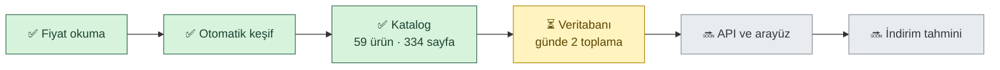
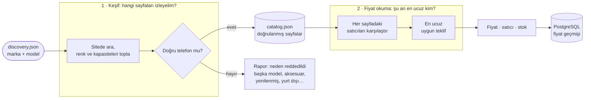
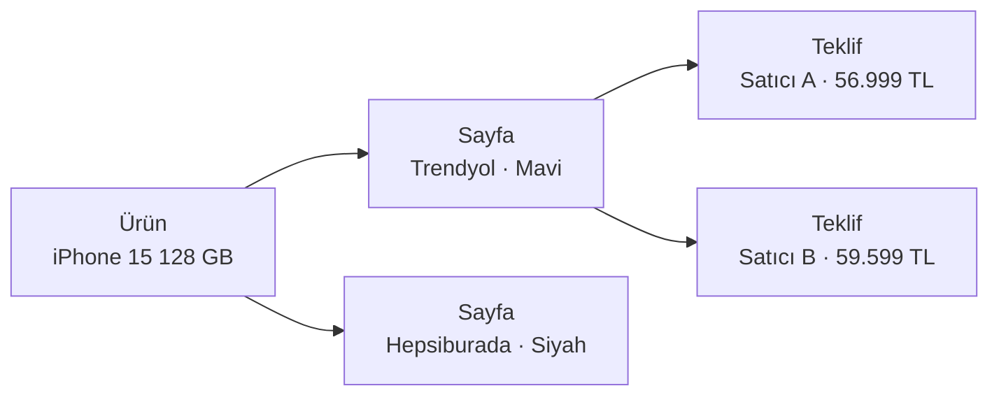
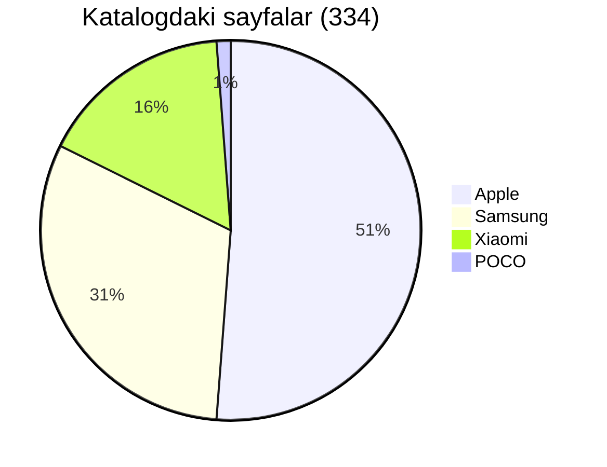

# 📱 Akıllı Telefon İndirim Takip Sistemi

[](https://github.com/Emir-Ars/Urun-indirim-takip/actions/workflows/ci.yml)


Trendyol ve Hepsiburada'daki akıllı telefonları takip eder ve her telefon için
**şu anki en ucuz teklifi** bulur. Hedef, fiyat geçmişini biriktirip bir
telefonun yakında indirime girip girmeyeceğini tahmin etmek.

> 📘 Ayrıntılı işleyiş, kurallar ve bilinen sınırlar: [docs/teknik.md](docs/teknik.md)
> · 🧭 Kararlar ve aşamalar: [proje_plani.md](proje_plani.md)

## Yol haritası


```mermaid
flowchart LR
    A["✅ Fiyat okuma"] --> B["✅ Otomatik keşif"]
    B --> C["✅ Katalog<br/>59 ürün · 334 sayfa"]
    C --> D["⏳ Veritabanı<br/>günde 2 toplama"]
    D --> E["🔜 API ve arayüz"]
    E --> F["🔜 İndirim tahmini"]
    classDef done fill:#d8f3dc,stroke:#2d6a4f,color:#1b4332
    classDef next fill:#fff3bf,stroke:#b08900,color:#5c4400
    classDef todo fill:#e9ecef,stroke:#868e96,color:#343a40
    class A,B,C done
    class D next
    class E,F todo
```

Bugün biten kısım: telefonların sayfalarını bulan **keşif** ve o sayfalardaki
fiyatları okuyan **scraper**. Sürmekte olan aşama: PostgreSQL veritabanı ve
günde 2 kez otomatik fiyat toplama.

## Nasıl çalışır


```mermaid
flowchart LR
    U(["discovery.json<br/>marka + model"]) --> K
    subgraph S1["1 · Keşif: hangi sayfaları izleyelim?"]
        K["Sitede ara,<br/>renk ve kapasiteleri topla"] --> V{"Doğru telefon mu?"}
    end
    V -- evet --> C[("catalog.json<br/>doğrulanmış sayfalar")]
    V -- "hayır" --> R["Rapor: neden reddedildi<br/>başka model, aksesuar,<br/>yenilenmiş, yurt dışı…"]
    C --> P
    subgraph S2["2 · Fiyat okuma: şu an en ucuz kim?"]
        P["Her sayfadaki<br/>satıcıları karşılaştır"] --> E["En ucuz<br/>uygun teklif"]
    end
    E --> O["Fiyat · satıcı · stok"]
    O --> DB[("PostgreSQL<br/>fiyat geçmişi")]
```

- **Keşif** yeni model eklerken ya da haftada bir çalışır. Sayfaları kullanıcı
  değil sistem bulur ve her birini ayrıca açıp doğrular. Görev Zamanlayıcı'ya
  kurulunca (`scripts/kesif_zamanlayici_kur.ps1`) her Pazar 14:00'te kataloğa
  yazmadan tarihli bir rapor bırakır; kullanıcı raporu inceler ve
  `python -m app.discovery --apply-report <rapor>` siteye gitmeden o raporu
  kataloğa ekler.
- **Fiyat toplama turu** (`python -m app.collection`) her sayfanın sonucunu
  PostgreSQL'e yazar. Görev Zamanlayıcı'ya kurulunca
  (`scripts/zamanlayici_kur.ps1`) her gün 10:00 ve 22:00'de penceresiz çalışır;
  çıktısı `data/logs/` altına yazılır.
- Yeni telefon eklemek için kod değişmez; `discovery.json` dosyasına bir satır
  eklenir.

## Temel kavramlar


```mermaid
flowchart LR
    P["Ürün<br/>iPhone 15 128 GB"] --> L1["Sayfa<br/>Trendyol · Mavi"]
    P --> L2["Sayfa<br/>Hepsiburada · Siyah"]
    L1 --> O1["Teklif<br/>Satıcı A · 56.999 TL"]
    L1 --> O2["Teklif<br/>Satıcı B · 59.599 TL"]
```

| Kavram | Anlamı |
|---|---|
| **Ürün** | Marka + model + hafıza. Fiyatlar bu düzeyde karşılaştırılır. |
| **Sayfa** (bağlantı) | Ürünün bir sitedeki bir sayfası; genelde her renk ayrı sayfadır. |
| **Teklif** | O sayfadaki bir satıcı ve fiyatı. |

iPhone 15 128 GB ile 256 GB farklı ürünlerdir; Pro, Plus, Ultra, FE, Edge gibi
modeller de ayrıdır. RAM ve garanti türü ürünü bölmez.

## Bugünkü kapsam

| | |
|---|---|
| Siteler | Trendyol, Hepsiburada |
| Takip edilen modeller | 24 (Apple 9 · Samsung 8 · Xiaomi 6 · POCO 1) |
| Katalog | 59 ürün, 334 sayfa (6 Ekim 2026; 2'si pasif) |
| Fiyat toplama | İlk tam tur 28 Eylül 2026: 326/326 sayfa, 31 dakika, hatasız. Görev Zamanlayıcı 28 Eylül'de kuruldu; günde 2 tur (10:00, 22:00) |
| Testler | 1029 otomatik test (228'i gerçek PostgreSQL üzerinde); her push'ta GitHub Actions. Testler internete çıkamaz ve gerçek veritabanına dokunamaz (otomatik emniyet kemerleri) |


```mermaid
pie title Katalogdaki sayfalar (334)
    "Apple" : 171
    "Samsung" : 104
    "Xiaomi" : 55
    "POCO" : 4
```

Katalog, sitelerin o gün gösterdiği sayfalardan oluşur; pazaryerinin eksiksiz
listesi değildir. Keşif yeniden çalıştıkça satışa giren yeni sayfalar eklenir.

## Hızlı başlangıç

Windows ve PowerShell:

```powershell
# 1. Kurulum
python -m venv .venv
.venv\Scripts\python.exe -m pip install -e ".[dev]"

# 2. Otomatik testler (internete çıkmaz; veritabanı testleri TEST_DATABASE_URL ister)
.venv\Scripts\python.exe -m pytest -q

# 3. Veritabanı (PostgreSQL 17 kurulduktan sonra, DATABASE_URL ile):
#    şemayı kur, katalogu veritabanına eşitle
.venv\Scripts\python.exe -m app.database migrate
.venv\Scripts\python.exe -m app.database sync-catalog

# 4. Fiyat toplama turu (sitelere istek atar; sonuçları veritabanına yazar)
.venv\Scripts\python.exe -m app.collection --prefix poco_

#    Her gün 10:00 ve 22:00 için Görev Zamanlayıcı'ya kur (yönetici izni gerekmez)
powershell -ExecutionPolicy Bypass -File scripts\zamanlayici_kur.ps1

# 5. Canlı deneme (sitelere istek atar; kataloğa ve veritabanına yazmaz,
#    keşif raporunu data/discovery_report.json dosyasının üzerine yazar)
[Console]::OutputEncoding = [Text.Encoding]::UTF8
.venv\Scripts\python.exe -m app.discovery --dry-run --target apple_iphone_15
.venv\Scripts\python.exe tests\manual\live_scraper_check.py apple_iphone_15_128
```

`--dry-run` kataloğa yazmaz; raporu `data/discovery_report.json` dosyasına
yazar. Haftalık keşfi ve incelenen raporun kataloğa eklenmesini
[docs/teknik.md](docs/teknik.md#zamanlanmış-keşif-görev-zamanlayıcı) anlatır:

```powershell
# Haftalık keşfi Pazar 14:00 için Görev Zamanlayıcı'ya kur (yönetici izni gerekmez)
powershell -ExecutionPolicy Bypass -File scripts\kesif_zamanlayici_kur.ps1

# İncelediğiniz önizleme raporunu siteye gitmeden kataloğa ekle
.venv\Scripts\python.exe -m app.discovery --apply-report data\discovery\kesif_<tarih-saat>.json
```

Canlı komutları arka arkaya çok kez çalıştırmayın; siteler geçici olarak
engelleyebilir. Bütün komutlar: [docs/teknik.md](docs/teknik.md#komutların-ayrıntısı).
PostgreSQL kurulumu (Türkçe Windows'ta locale `C` seçilmeli) ve veritabanı
kuralları: [docs/teknik.md](docs/teknik.md#veritabanı-postgresql).

### Cimri geçmişinin yerel alımı (Adım 9.1)

8 Ekim üç ürün kontrolünde iPhone 16 ve Galaxy S24'ün 365'er noktası ve
90'ar tablo eşleşmesi doğrulandı. Xiaomi'nin grafiğindeki dört sıfır fiyat
ilk alımda reddedildi; kullanıcı kararıyla aynı tarihte tabloda fiyat yoksa
eksik değer (`null`) olarak okunuyor. Kaydedilmiş yanıt yeniden doğrulandı:
361 geçerli fiyat, dört eksik gün ve 86 tablo eşleşmesi. İlk rapor değişmedi.
`config/market_history.json` 59 ürünün 57'sinin araştırılmış ana adresini
içerir. Galaxy S25 512 GB ve Redmi Note 14 Pro 5G 256 GB için doğru ana
adres doğrulanamadı; Cimri'de olmadıkları sonucuna varılmadı. 8 Ekim
10:49–10:58 katalog alımında **53 ürün doğrulandı, dört ürün aynı günün
gömülü tablo ve ham API fiyatı uyuşmadığı için reddedildi**, iki ürün eşleştirmesiz kaldı.
53 ürünün toplam 19.345 tarihli noktasında 18.792 fiyat ve 553 eksik değer
var; 4.413 tablo satırı eşleşti. 11:12–11:13 tekrarında dört uyuşmazlık da
aynı kaldı. Kullanıcı tarayıcıda grafik ile tablonun eşleştiğini bildirdi;
programın ham API yanıtı ile ekrandaki grafik aynı kabul edilemez. Alım
gününü eksik sayma önerisi geri çekildi. Kaynak JavaScript incelemesi, grafiğin
bugünkü API fiyatını sayfanın ilk teklif fiyatıyla değiştirdiğini doğruladı.
Kullanıcı onayıyla bu kural uygulandı; tarih kontrolü ve kullanılan fiyatın
kaynağı rapora eklendi. Yeni kodla 57 ürünün kayıtlı tam yanıtı ağsız doğrulandı:
20.805 nokta, 20.252 fiyat, 553 eksik değer, 4.773 tablo eşleşmesi. Önceki
52 ürünün bütün noktaları aynı; S24 Ultra 1 TB'nin yalnız 8 Ekim fiyatı
85.680 → 86.220 TL oluyor. Son günün tablo satırı yoksa komut bunu bildirir.
Son tam kontrol: **1029 test geçti, 0 atlandı**, Black/Flake8 temiz.
13:51–13:52 canlı teyidinde beş ürünün tamamı kaydedildi; çıkış 0.
1.825 noktada 1.754 fiyat ve 71 eksik değer var; 450 tablo satırı eşleşti.
S24 Ultra 1 TB'nin 71 eksik günü önceki kayıttakiyle aynı.
9.1'in uygulama ve canlı doğrulaması tamamlandı; kullanıcı commit/push
işlemini onayladı. CI sonucu gönderilen commit için GitHub Actions
kaydından doğrulanır.
Eski raporlar ve ham kayıtlar korunuyor; veritabanına aktarım başlamadı.

Zamanlanmış tur bittikten sonra, yeni bir klasöre katalog alımı için:

```powershell
$cimriKlasor = "data\market_history\katalog_$(Get-Date -Format yyyyMMdd_HHmmss_fff)"
.venv\Scripts\python.exe -m app.market_history capture `
  --mapping config\market_history.json --output-dir $cimriKlasor
$LASTEXITCODE
```

Komut HTML, API JSON yanıtı ve `report.json` oluşturur; katalog ve veritabanına
yazmaz. Şu an iki eşleştirme eksik olduğundan 57 alım başarılı olsa da çıkış
**2** olur; ürün hataları ve denenmeyenler rapordan ayrıca kontrol edilir.
Tek ürün için `--product-key <anahtar>` eklenebilir.
Çıkış 0 seçilen ürünler kaydedildi, 2 kısmi sonuç, 1 başlatma/dosya
hatası, 3 ortak kilit meşgul, 130 Ctrl+C demektir. Grafik fiyatları raporda
kuruştur; eksik fiyat `null` kalır. Aktarım komutu ve `004` migration **9.2'de
hazırlanacak**, şu anda yoktur. Ayrıntılar: [teknik rehber](docs/teknik.md#cimri-geçmişinin-yerel-alımı-adım-91).

## Yeni telefon ekleme

`config/discovery.json` dosyasındaki `targets` listesine bir satır eklenir:

```json
{"key": "samsung_galaxy_s25", "brand": "Samsung", "model": "Galaxy S25"}
```

- **brand:** sitedeki marka etiketi (ör. POCO ayrı bir markadır).
- **model:** markasız, tam model adı. "Galaxy S25", S25 Ultra ya da S25 Edge'i
  kapsamaz.
- Aynı adı taşıyan farklı telefonlar için (ör. 4G / 5G sürümler)
  `exclude_terms` ve `network` alanları var:
  [ayrıntılar](docs/teknik.md#yeni-telefon-ekleme-bütün-kurallar).

## Proje yapısı

```text
config/
  discovery.json    takip edilecek telefonlar (kullanıcı yazar)
  catalog.json      doğrulanmış ürünler ve sayfalar (keşif yazar)
  runtime.json      zaman aşımı, tekrar deneme, istekler arası bekleme
  market_history.json  bir defalık Cimri alımının ürün/adres/kimlik eşleştirmeleri
app/
  contracts.py      veri şekilleri ve doğrulama
  scraper/          fiyat okuma: tek HTTP kapısı, ortak kimlik kuralları, site okuyucuları
  discovery/        keşif: site aramaları, katalogla birleştirme, rapor, raporu uygulama
  database/         PostgreSQL: bağlantı, migration dosyaları, katalog eşitleme, tur SQL'leri
  collection/       fiyat toplama turu: sayfaları okuyup sonuçları veritabanına yazar
  market_history/   Cimri geçmişi: eşleştirme, ağsız doğrulama ve yerel alım
  scrape_lock.py    siteye giden bütün girişlerin ortak kilidi
  console.py        zamanlanmış komutların ortak çıktı ve log yardımcıları
  settings.py       config dosyalarını okur; dosya ve klasör yolları ortam değişkeniyle değişir
scripts/
  zamanlayici_kur.ps1        günde 2 turu Windows Görev Zamanlayıcı'ya kurar
  kesif_zamanlayici_kur.ps1  haftalık keşfi (Pazar 14:00, katalog yazmadan) kurar
tests/              otomatik testler; manual/ altında canlı kontrol araçları
.github/workflows/  ci.yml (her push: Black, Flake8, testler) ve bulut-deneme.yml
                    (elle tetiklenen canlı okuma denemesi)
docs/teknik.md      ayrıntılı teknik rehber
pyproject.toml      bağımlılıklar ve araç ayarları
```

## İlkeler

- **Veri uydurulmaz.** Bulunamayan fiyat ya da stok boş kalır ve hata olarak
  raporlanır.
- **"Tükendi" yalnızca sitenin açık sinyaliyle** verilir; bağlantı hatası
  "Tükendi" sayılmaz.
- **Siteye nazik davranılır.** Bütün istekler tek kapıdan geçer; aynı siteye
  istekler arasında 3 saniye beklenir.
- **"Testler geçti", "pazaryerinin tamamı tarandı" demek değildir.** Bilinen
  sınırlar [teknik rehberde](docs/teknik.md#bilinen-sınırlar) listelenir.

## Not

Önceki aşamalardan kalan yerel taslaklar (eski veritabanı, API, ML, arayüz ve
Docker dosyaları) `_eski_taslaklar/` klasöründedir. Git'e gönderilmezler ve
bugünkü kodla çalışmazlar; yalnızca örnek olarak incelenebilirler.
