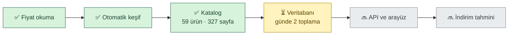
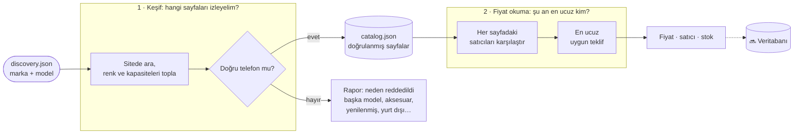
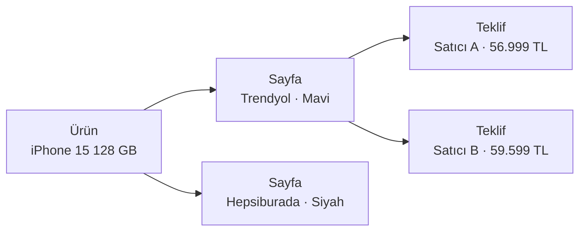
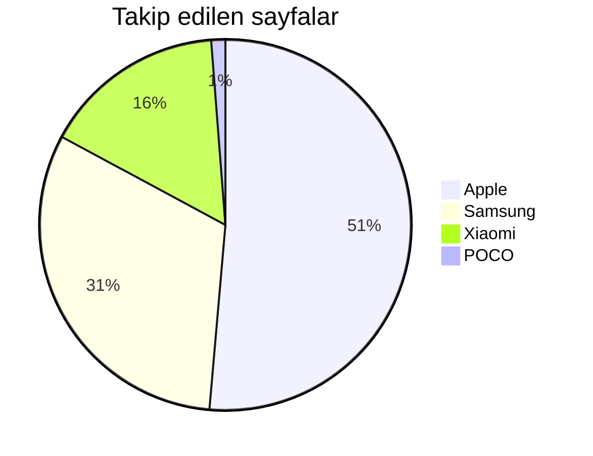

# 📱 Akıllı Telefon İndirim Takip Sistemi

[](https://github.com/Emir-Ars/Urun-indirim-takip/actions/workflows/ci.yml)


Trendyol ve Hepsiburada'daki akıllı telefonları takip eder ve her telefon için
**şu anki en ucuz teklifi** bulur. Hedef, fiyat geçmişini biriktirip bir
telefonun yakında indirime girip girmeyeceğini tahmin etmek.

> 📘 Ayrıntılı işleyiş, kurallar ve bilinen sınırlar: [docs/teknik.md](docs/teknik.md)
> · 🧭 Kararlar ve aşamalar: [proje_plani.md](proje_plani.md)

## Yol haritası


```mermaid
flowchart LR
    A["✅ Fiyat okuma"] --> B["✅ Otomatik keşif"]
    B --> C["✅ Katalog<br/>59 ürün · 327 sayfa"]
    C --> D["⏳ Veritabanı<br/>günde 2 toplama"]
    D --> E["🔜 API ve arayüz"]
    E --> F["🔜 İndirim tahmini"]
    classDef done fill:#d8f3dc,stroke:#2d6a4f,color:#1b4332
    classDef next fill:#fff3bf,stroke:#b08900,color:#5c4400
    classDef todo fill:#e9ecef,stroke:#868e96,color:#343a40
    class A,B,C done
    class D next
    class E,F todo
```

Bugün biten kısım: telefonların sayfalarını bulan **keşif** ve o sayfalardaki
fiyatları okuyan **scraper**. Sürmekte olan aşama: PostgreSQL veritabanı ve
günde 2 kez otomatik fiyat toplama.

## Nasıl çalışır


```mermaid
flowchart LR
    U(["discovery.json<br/>marka + model"]) --> K
    subgraph S1["1 · Keşif: hangi sayfaları izleyelim?"]
        K["Sitede ara,<br/>renk ve kapasiteleri topla"] --> V{"Doğru telefon mu?"}
    end
    V -- evet --> C[("catalog.json<br/>doğrulanmış sayfalar")]
    V -- "hayır" --> R["Rapor: neden reddedildi<br/>başka model, aksesuar,<br/>yenilenmiş, yurt dışı…"]
    C --> P
    subgraph S2["2 · Fiyat okuma: şu an en ucuz kim?"]
        P["Her sayfadaki<br/>satıcıları karşılaştır"] --> E["En ucuz<br/>uygun teklif"]
    end
    E --> O["Fiyat · satıcı · stok"]
    O -.-> DB[("🔜 Veritabanı")]
```

- **Keşif** seyrek çalışır; yeni model eklerken ya da ara sıra. Sayfaları
  kullanıcı değil sistem bulur ve her birini ayrıca açıp doğrular.
- **Fiyat okuma** günde 2 kez (10:00 ve 22:00) çalışıp sonuçları PostgreSQL'e
  yazacak (veritabanı aşaması, sürüyor). Bugün sonucu ekrana ve dosyaya yazar.
- Yeni telefon eklemek için kod değişmez; `discovery.json` dosyasına bir satır
  eklenir.

## Temel kavramlar


```mermaid
flowchart LR
    P["Ürün<br/>iPhone 15 128 GB"] --> L1["Sayfa<br/>Trendyol · Mavi"]
    P --> L2["Sayfa<br/>Hepsiburada · Siyah"]
    L1 --> O1["Teklif<br/>Satıcı A · 56.999 TL"]
    L1 --> O2["Teklif<br/>Satıcı B · 59.599 TL"]
```

| Kavram | Anlamı |
|---|---|
| **Ürün** | Marka + model + hafıza. Fiyatlar bu düzeyde karşılaştırılır. |
| **Sayfa** (bağlantı) | Ürünün bir sitedeki bir sayfası; genelde her renk ayrı sayfadır. |
| **Teklif** | O sayfadaki bir satıcı ve fiyatı. |

iPhone 15 128 GB ile 256 GB farklı ürünlerdir; Pro, Plus, Ultra, FE, Edge gibi
modeller de ayrıdır. RAM ve garanti türü ürünü bölmez.

## Bugünkü kapsam

| | |
|---|---|
| Siteler | Trendyol, Hepsiburada |
| Takip edilen modeller | 24 (Apple 9 · Samsung 8 · Xiaomi 6 · POCO 1) |
| Katalog | 59 ürün, 327 sayfa (28 Eylül 2026) |
| Testler | 59 otomatik test; her push'ta GitHub Actions |


```mermaid
pie title Takip edilen sayfalar
    "Apple" : 168
    "Samsung" : 103
    "Xiaomi" : 52
    "POCO" : 4
```

Katalog, sitelerin o gün gösterdiği sayfalardan oluşur; pazaryerinin eksiksiz
listesi değildir. Keşif yeniden çalıştıkça satışa giren yeni sayfalar eklenir.

## Hızlı başlangıç

Windows ve PowerShell:

```powershell
# 1. Kurulum
python -m venv .venv
.venv\Scripts\python.exe -m pip install -e ".[dev]"

# 2. Otomatik testler (internete çıkmaz)
.venv\Scripts\python.exe -m pytest -q

# 3. Canlı deneme (sitelere istek atar)
[Console]::OutputEncoding = [Text.Encoding]::UTF8
.venv\Scripts\python.exe -m app.discovery --dry-run --target apple_iphone_15
.venv\Scripts\python.exe tests\manual\live_scraper_check.py apple_iphone_15_128
```

`--dry-run` kataloğa yazmaz; raporu `data/discovery_report.json` dosyasına
yazar. Canlı komutları arka arkaya çok kez çalıştırmayın; siteler geçici olarak
engelleyebilir. Bütün komutlar: [docs/teknik.md](docs/teknik.md#komutların-ayrıntısı).

## Yeni telefon ekleme

`config/discovery.json` dosyasındaki `targets` listesine bir satır eklenir:

```json
{"key": "samsung_galaxy_s25", "brand": "Samsung", "model": "Galaxy S25"}
```

- **brand:** sitedeki marka etiketi (ör. POCO ayrı bir markadır).
- **model:** markasız, tam model adı. "Galaxy S25", S25 Ultra ya da S25 Edge'i
  kapsamaz.
- Aynı adı taşıyan farklı telefonlar için (ör. 4G / 5G sürümler)
  `exclude_terms` ve `network` alanları var:
  [ayrıntılar](docs/teknik.md#yeni-telefon-ekleme-bütün-kurallar).

## Proje yapısı

```text
config/
  discovery.json    takip edilecek telefonlar (kullanıcı yazar)
  catalog.json      doğrulanmış ürünler ve sayfalar (keşif yazar)
  runtime.json      zaman aşımı, tekrar deneme, istekler arası bekleme
app/
  contracts.py      veri şekilleri ve doğrulama
  scraper/          fiyat okuma: tek HTTP kapısı, ortak kimlik kuralları, site okuyucuları
  discovery/        keşif: site aramaları, katalogla birleştirme, rapor
tests/              otomatik testler; manual/ altında canlı kontrol araçları
docs/teknik.md      ayrıntılı teknik rehber
```

## İlkeler

- **Veri uydurulmaz.** Bulunamayan fiyat ya da stok boş kalır ve hata olarak
  raporlanır.
- **"Tükendi" yalnızca sitenin açık sinyaliyle** verilir; bağlantı hatası
  "Tükendi" sayılmaz.
- **Siteye nazik davranılır.** Bütün istekler tek kapıdan geçer; aynı siteye
  istekler arasında 3 saniye beklenir.
- **"Testler geçti", "pazaryerinin tamamı tarandı" demek değildir.** Bilinen
  sınırlar [teknik rehberde](docs/teknik.md#bilinen-sınırlar) listelenir.

## Not

Önceki aşamalardan kalan yerel taslaklar (eski veritabanı, API, ML, arayüz ve
Docker dosyaları) `_eski_taslaklar/` klasöründedir. Git'e gönderilmezler ve
bugünkü kodla çalışmazlar; yalnızca örnek olarak incelenebilirler.
