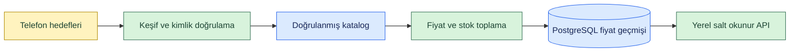
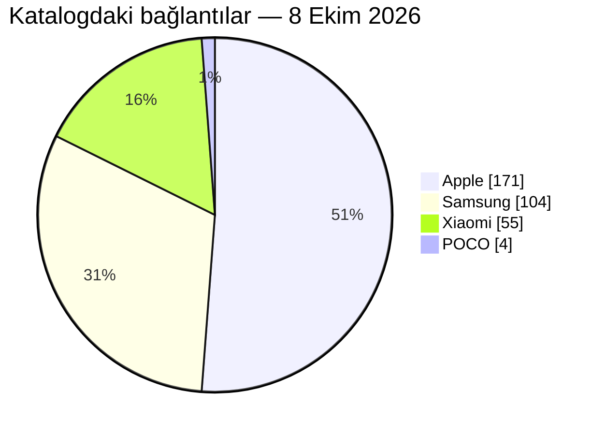

# 📱 Akıllı Telefon İndirim Takip Sistemi

Trendyol ve Hepsiburada’daki akıllı telefonları keşfeden, fiyat ve stok
bilgilerini düzenli toplayıp PostgreSQL’de saklayan bir proje. Takip edilen
sayfalardan son toplanan teklifleri karşılaştırır ve fiyat geçmişi oluşturur.
Uzun vadeli hedef, bu geçmişten telefonun yakında indirime girme olasılığını
hesaplamaktır.

> ✅ **Keşif, fiyat toplama ve veritabanı aşamaları tamamlandı.**
> Salt okunur yerel API ve fiyat istatistikleri hazır; çalışan ekran ve tahmin modeli henüz yok.

## ✨ Tamamlanan özellikler

- 🔎 **Otomatik keşif:** model, kapasite ve renk seçeneklerinin bağlantılarını
  bulur; başka model, aksesuar ve kapsam dışı ürünleri kimlik kontrolünden geçirir.
- 🏷️ **Teklif seçimi:** ürün sayfasındaki uygun satıcı tekliflerini karşılaştırır;
  seçilen fiyatı, satıcıyı ve stok durumunu kaydeder.
- ⏰ **Düzenli toplama:** Windows Görev Zamanlayıcı ile günde iki fiyat turu ve
  haftalık keşif raporu üretir. Yeni bağlantılar incelenen rapordan kataloğa alınır.
- 🗄️ **Kalıcı kayıt:** sonuçları tur ve sayfa düzeyinde saklar; tekrar kayıtları
  ve kapanmış sonuçların değiştirilmesini veritabanı kurallarıyla engeller.
- ⚖️ **Güvenli karşılaştırma:** cevap veren sayfa kümesi değişen turları fiyat
  düşüşü karşılaştırmasından ayırır. Okuma hatası stoksuzluk olarak kaydedilmez.
- 📅 **Bir defalık geçmiş aktarımı:** doğrulanmış Cimri geçmişini ayrı tabloda
  saklar; tekrar aktarımda kayıt çoğaltmadan ilk kaynak bilgilerini korur.
- 🌐 **Yerel API:** kayıtlı teklifleri, iki ayrı fiyat geçmişini ve veri
  yeterliliği açıklanan istatistikleri salt okunur sunar.

## 🔄 Çalışma akışı

```mermaid
flowchart LR
    A["Telefon hedefleri"] --> B["Keşif ve kimlik doğrulama"]
    B --> C["Doğrulanmış katalog"]
    C --> D["Fiyat ve stok toplama"]
    D --> E[("PostgreSQL fiyat geçmişi")]
    E --> F["Yerel salt okunur API"]
    classDef targets fill:#fff3bf,stroke:#b08900,color:#1b4332
    classDef processing fill:#d8f3dc,stroke:#2d6a4f,color:#1b4332
    classDef records fill:#dbeafe,stroke:#2563eb,color:#172554
    class A targets
    class B,D,F processing
    class C,E records
```

Telefonlar marka, model ve kapasite düzeyinde takip edilir. Keşif hangi
sayfaların izleneceğini belirler; toplama bu sayfaların fiyat, stoksuzluk veya
hata sonucunu kaydeder. Cimri geçmişi bu akışın gözlemleriyle birleştirilmez.

## 🛠️ Teknolojiler

| Teknoloji | Görevi |
|---|---|
| Python 3.13 | Keşif, fiyat toplama ve aktarım uygulaması |
| curl_cffi · BeautifulSoup4 | HTTP erişimi ve sayfa ayrıştırma |
| Pydantic | Veri şekilleri ve kimlik sözleşmelerinin doğrulanması |
| PostgreSQL 17 · Psycopg 3 | Kalıcı kayıt, SQL kuralları ve işlemler |
| FastAPI · Uvicorn · Psycopg Pool | Yerel, salt okunur API ve bağlantı havuzu |
| Windows Görev Zamanlayıcı | Günlük toplama ve haftalık keşif |
| pytest · Black · Flake8 · GitHub Actions | Otomatik testler ve kod denetimleri |

## 📊 Doğrulanmış kapsam

Veri ve katalog kontrolleri 8 Ekim 2026, otomatik test sonucu 9 Ekim 2026:

| Alan | Sonuç |
|---|---|
| Fiyat kaynakları | Trendyol ve Hepsiburada |
| Model aileleri | 24; Apple, Samsung, Xiaomi ve POCO |
| Katalog | 59 ürün, 334 bağlantı; 332 etkin bağlantı |
| Toplama düzeni | Her gün 10:00 ve 22:00; haftalık keşif Pazar 14:00 |
| Son doğrulanan fiyat turu | 332 sonuç: 237 fiyat, 95 Tükendi, 0 hata |
| Cimri geçmişi | 57 ürün, 20.805 tarihli kayıt; 20.252 fiyat ve 553 eksik değer |
| Otomatik testler | 1447 test; 412’si PostgreSQL üzerinde |

Katalogdaki **334 bağlantının markalara göre dağılımı** (iki pasif bağlantı dahil):

```mermaid
pie showData
    title Katalogdaki bağlantılar — 8 Ekim 2026
    "Apple" : 171
    "Samsung" : 104
    "Xiaomi" : 55
    "POCO" : 4
```

Son tam yerel test paketinde atlanan veya beklenen başarısızlık yoktu.
Her push’ta CI, testler ile Black ve Flake8 denetimlerini çalıştırır.
Otomatik testler canlı ağa çıkmaz; veritabanı testleri yalnız test veritabanını kullanır.

Katalog pazaryerlerinin tamamını kapsamaz. Cimri’de iki ürünün eşleştirmesi
doğrulanamadı; eksik fiyatlar doldurulmadı. Kaynak ve işletim sınırları
[teknik rehberde](docs/teknik.md#bilinen-sınırlar) açıklanır.

## 🗺️ Yol haritası

| Aşama | Durum |
|---|---|
| Fiyat okuma, keşif, katalog, veritabanı ve zamanlanmış toplama | ✅ Tamamlandı |
| FastAPI ve Streamlit ile verileri sunma ve görüntüleme | 🛠️ Yerel API ve istatistikler hazır; istemci ve ekran sırada |
| ML ile indirim olasılığı tahmini | 🔜 Planlandı |
| Docker ve sürekli çalışma ortamı | 🔜 Planlandı |

## 📚 Belgeler

- [Teknik rehber](docs/teknik.md): kurulum, çalıştırma, veri kuralları ve bakım ayrıntıları.
- [Proje planı](proje_plani.md): aşamalar, kararlar ve geliştirme geçmişi.
